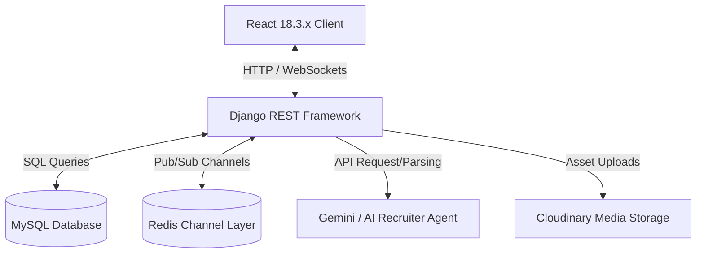

# JobSphere AI - System Architecture

This document describes the high-level system design, data flows, components interaction, and technical design patterns for **JobSphere AI**.

---

## 1. High-Level Architecture Overview

JobSphere AI uses a modern, multi-tier architecture configured as an enterprise monorepo:

### Key Components:
- **Frontend Presentation Layer**: Built with React 18.3.x, TypeScript, Tailwind CSS v3.4.x, and Framer Motion. Uses React Router DOM for routing and Axios with automatic JWT interceptors for backend requests.
- **API Gateway & Backend Layer**: Django 5.x REST Framework acting as the core API handler. Handles authentication (Simple JWT), object serialization, filtering, and system controllers.
- **WebSocket Protocol Layer**: Django Channels coupled with Redis to deliver instant notifications, real-time message exchange, and processing updates.
- **Persistent Data Tier**: MySQL 8.0 containing transactional application models.
- **Asset/Cloud Media Tier**: Cloudinary for candidate resume storage and recruiter company branding assets.

---

## 2. Authentication & Session Lifecycles

We enforce standard stateless token authentication utilizing JSON Web Tokens (JWT) through Django REST Framework Simple JWT:

1. **Sign-In Flow**:
   - The user inputs credentials via `AuthLayout.tsx`.
   - The backend validates password hashes and returns `access_token` (15 mins lifespan) and `refresh_token` (7 days lifespan).
   - Tokens are stored locally on the client.

2. **Access Token Refresh**:
   - The client-side Axios client interceptor detects expired access tokens (HTTP 401).
   - The client automatically makes a silent POST request to `/api/auth/token/refresh/` using the `refresh_token`.
   - If the refresh token is valid, a new access token is returned and stored.
   - If expired, the session is invalidated, and the user is redirected to `/auth/login`.

---

## 3. Real-Time Protocol Routing (WebSockets)

For live event processing (e.g. AI resume parsing updates, instant messenger notifications), we employ Django Channels:

- **ASGI Protocol Router**: Standard ASGI acts as the protocol entry point, routing HTTP traffic to standard Django WSGI views, and WebSocket connections (`ws://`) to the `AuthMiddlewareStack`.
- **Channel Layer**: Redis hosts the Pub/Sub messaging backend, allowing different worker threads and consumers to publish events to client sockets seamlessly.
